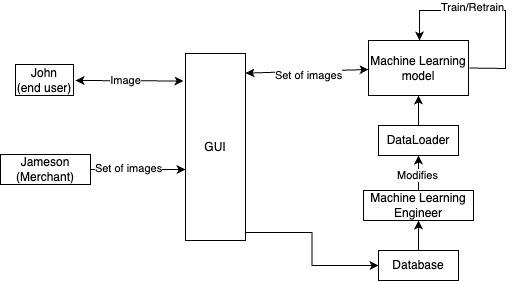

# This is the Software Design Document.
## User Stories
1. John is an end user. They want to find products that match their fashion sense. They want an easy to use and simple interface. Their skill level is minimal and their job does not involve any technical skills.
2. Jonah is a machine learning engineer. They want to train the neural network model component, test the model and save it. They want a neural net that is easy to train and retrain. They also want the outputs of the model to make sense. They have technical knowledge of machine learning.
3. Jameson is a merchant. They want to add thier products so that they get recognized. They want an easy to use interface to upload their products. They have minimal technical skills.
4. JuniorMart is a company. They want to use this software for recommending their own products. They want the software to be modular so that they can easily integrate it on their platform. They have highly skilled engineers that are skilled in integration. 

## Use Cases
1. Customer/End user will upload the image of a fashion product on the GUI. The software will pull up similar images from its database to the uploaded image.
2. A merchant will upload images of his products on the GUI. The software will upload these images to its database and create an alert to notify the Machine learning engineer that new data has been uploaded. The GUI will also give a confirmation to the merchant.
3. Machine Learning engineer will append the new images in the dataset used for training and train and test a new model. They will also deploy the most recent model.
   
## Specifications of Components
1. Graphical User Interface
    * What it does: Provides an interface between the machine learning pipeline in the backend and the customer(display similar images). It also provides an interface for merchants to upload their products to its database. It also creates alerts once new data is uploaded.
    * Input: Images (.jpg, .png)
    * Outputs: Similar images (display on GUI), alerts
2. Machine Learning Pipeline
    * What it does: Predicts similar images for a given input image. Sends image to the GUI for display. Also provides statistics about its accuracy for the machine learning engineer.
    * Input: Single Image(.jpg) received from the GUI.
    * Output: Sets of similar image to the given input(either .jpg images or embeddings that can be used to retrieve images from database). Accuracy values for the model.
3. Database
    * What it does: Stores images and their features(brand, type of product, launch date, etc.)
    * Input: Images and possibly their features.
    * Ouput: None
4. Data Loader
    * What it does: Applies pre processing to new and uploaded data. Creates training and test sets for the machine learning model. Machine learning engineer can make changes to this according to the use case.
    * Input: Images and features from the database.
    * Output: Pre processed sets of training and testing images.

## Interaction diagram

